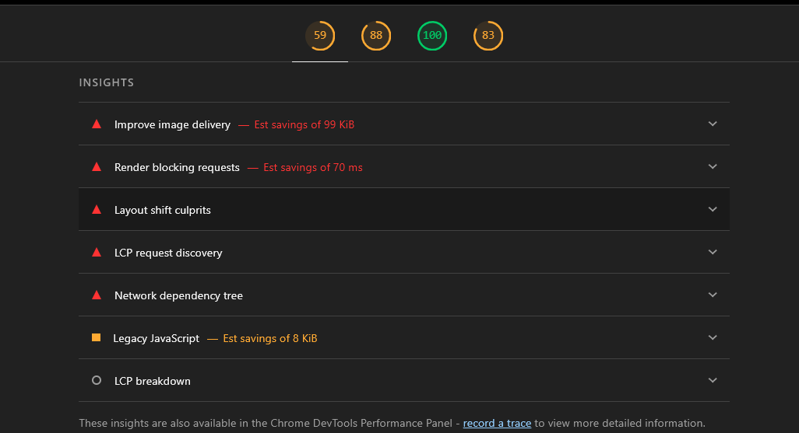

## ⏭ NEXT PHASES
| Features         | Dependencies |  
|------------------|---------|
|  **Authentication and authorization**     |  | 
|  **Not found template**     |  |  
|  **Add owner details**      |  |  
|  **Borrowed or given**      |  |  
|  **Image url for the books**      |  |  
|  **File upload option**  |  |  
|  **User authntication** | |  
|  **Loader in all pages** | |

### Additional changes:
1. use toast everywhere instead of message in bookSlice and other files
2. [browser] Image with src "/booked-logo.png" was detected as the Largest Contentful Paint (LCP). Please add the `loading="eager"` property if this image is above the fold.
Read more: https://nextjs.org/docs/app/api-reference/components/image#loading - look for the solution for this

** TRY MAKING BACKEND HERE
using supabase for baas

